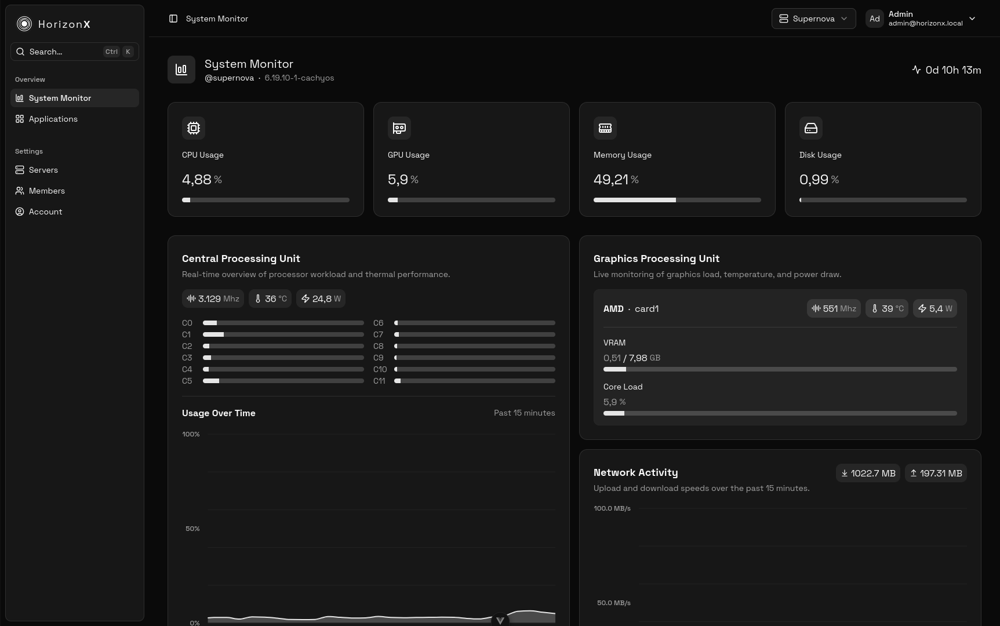
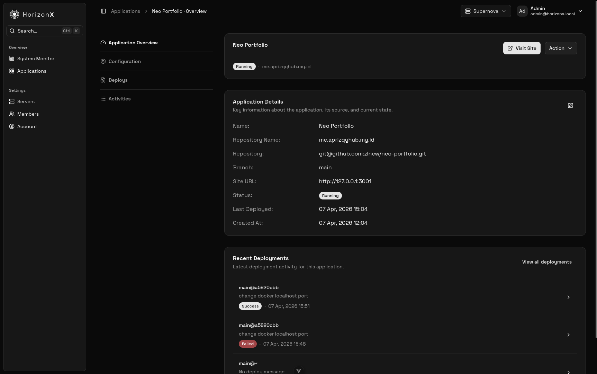

# HorizonX

**The All-in-One Infrastructure Monitoring & Deployment Platform.**

HorizonX serves as the command center for your infrastructure. It allows you to monitor the real-time health of your distributed servers and deploy applications seamlessly using GitOps principles. Whether you have one server or a hundred, HorizonX brings them all into a single, unified view.

> **Note**: This repository contains the **Backend Server** code.  
> The **Frontend Dashboard** can be found here: [https://github.com/zlnew/horizonx-dashboard](https://github.com/zlnew/horizonx-dashboard)






---

## 🧩 How It Works

HorizonX is built on a **Client-Server** model designed for speed and security:

1.  **The Server (Control Plane)**:
    - This is the central API.
    - It stores all data, manages user accounts, and handles application state.
    - You interact with this via a Web Dashboard.

2.  **The Agent (Runner)**:
    - A lightweight, standalone program that you install on your Linux servers.
    - It securely connects back to your **Server** via a persistent WebSocket connection.
    - It pushes hardware metrics (CPU, RAM, usage) every second and listens for commands (like "Deploy App").

---

## ✨ Key Features

### 1. 📊 Real-Time Infrastructure Monitoring

Forget about lagging charts. HorizonX provides **second-by-second** telemetry for your hardware.

- **CPU**: See per-core load, temperatures, and power usage (Watts).
- **Memory**: Visualize RAM and Swap usage to prevent OOM errors.
- **Disk & Network**: Monitor I/O throughout, disk space, and network bandwidth in real-time.
- **GPU Support**: Native monitoring for Nvidia GPUs for AI/ML workloads.

### 2. 🚀 Zero-Downtime Application Deployments

Deploy applications directly from your Git repositories (GitHub, GitLab, etc.).

- **GitOps**: Push to your branch, and HorizonX pulls the latest code.
- **Process Management**: HorizonX uses **Docker Compose** to manage the full application lifecycle (Deploy, Start, Stop, Restart), ensuring consistent environments.
- **Env Vars**: Securely inject API keys and secrets into your running applications.

### 3. 🛡️ Secure & Scalable

- **Clean Architecture**: Built with a robust Go backend for high performance.
- **Token Authentication**: Agents require a secure token to join your fleet, preventing unauthorized access.

---

## � Requirements

To run HorizonX components, you need:

- **Operating System**: Linux.
- **Go**: Version 1.25.4 or higher (to compile binaries).
- **Database**: PostgreSQL 13+.
- **Redis**: Required for caching and real-time features.
- **Git**: **Required** for cloning repositories and deployment operations. The Agent uses Git to clone your repositories.
- **Docker & Docker Compose**: **Required** for Application Management features (Deploy, Start, Stop, Restart). The Agent uses Docker Compose to manage your deployments.

---

## 📦 Quick Start (Development)

Use these steps to run the project locally for testing or development.

### 1. Setup Control Plane (Server)

```bash
# Configure environment
cp .env.example .env
# Open .env and set your HTTP_ADDR, ALLOWED_ORIGINS, DATABASE_URL, etc.

# Initialize Database
make migrate-up
make seed # (Optional: Adds dummy data)

# Start Server
make run-server
```

### 2. Connect a Node (Agent)

> Before setting up an agent, you need to setup **HorizonX Dashboard**: [https://github.com/zlnew/horizonx-dashboard](https://github.com/zlnew/horizonx-dashboard).
> After that, open horizonx dashboard, login and register a new server. You will get `HORIZONX_SERVER_API_TOKEN` and `HORIZONX_SERVER_ID`.

```bash
# Build binary
make build

# Setup .env
HORIZONX_API_URL="http://localhost:3000"
HORIZONX_WS_URL="ws://localhost:3000/agent/ws"

# Copy the HORIZONX_SERVER_API_TOKEN and HORIZONX_SERVER_ID from registered server
HORIZONX_SERVER_API_TOKEN="hzx_secret"
HORIZONX_SERVER_ID="123"

sudo ./bin/agent
```

For development purpose, its highly recommended to start agent as root to be able to collect server metrics.
Note that if application's git repo url use ssh, please make sure root have ssh access to your git repository.

---

## 🏭 Production Installation

HorizonX provides automated scripts in the `scripts/` directory to install the Control Plane (Server) and Agents securely.
These scripts ensure all services run under a dedicated `horizonx` user with access to Docker and Git, while keeping root privileges minimal.
They also handle log rotation, environment setup, and hardware monitoring permissions.

### 1. Installing the Server

Run this on the machine that will host the Control Plane.

1.  **Build Binaries**:
    ```bash
    make build
    ```
2.  **Run Installer**:

    ```bash
    sudo ./scripts/install-server.sh

    # If you want to seed default user
    sudo ./scripts/install-server.sh --seed

    ```

    **What this does:**
    - Installs binary to: `/usr/local/bin/horizonx-server`
    - Configuration: `/var/lib/horizonx/server.env`
    - Logs: `/var/log/horizonx/server.log` & `server.error.log`
    - Systemd service: `horizonx-server`
    - Runs as: `horizonx` user (non-root)
    - Sets permissions for safe log & data directories

3.  **Post-Install**:
    - Edit `/var/lib/horizonx/server.env` with your production:
      - `HTTP_ADDR`
      - `ALLOWED_ORIGINS`
      - `DATABASE_URL`
      - `REDIS_ADDR`
      - `JWT_SECRET`.
    - Restart the service: `sudo systemctl restart horizonx-server`

### 2. Installing an Agent

> Before setting up an agent, you need to setup **HorizonX Dashboard**: [https://github.com/zlnew/horizonx-dashboard](https://github.com/zlnew/horizonx-dashboard).
> After that, open horizonx dashboard, login and register a new server. You will get `HORIZONX_SERVER_API_TOKEN` and `HORIZONX_SERVER_ID`.

Run this on every remote server you want to monitor and deploy applications to.

1.  **Build Binaries** (or copy `bin/agent` from your build server):
    ```bash
    make build
    ```
2.  **Run Installer**:

    ```bash
    sudo ./scripts/install-agent.sh
    ```

    **What this does:**
    - Installs binary to: `/usr/local/bin/horizonx-agent`
    - Configuration: `/var/lib/horizonx/agent.env`
    - Logs: `/var/log/horizonx/agent.log` & `agent.error.log`
    - Systemd service: `horizonx-agent`
    - Runs as: `horizonx` user (non-root)
    - Creates `.ssh` keys and config for Git access
    - Adds `horizonx` user to Docker group for deployment access
    - Sets hardware monitoring permissions (CPU, GPU, power, thermal, disk, network) via udev rules
    - Sets Git SSH wrapper to ensure all repo operations use the dedicated key

3.  **Post-Install**:
    - Edit `/var/lib/horizonx/agent.env`. You **MUST** set:
      - `HORIZONX_API_URL`
      - `HORIZONX_WS_URL`
      - `HORIZONX_SERVER_API_TOKEN`
      - `HORIZONX_SERVER_ID`.
    - Restart the service: `sudo systemctl restart horizonx-agent`
    - Public SSH key is available at: `/var/lib/horizonx/.ssh/id_ed25519.pub` – **add this to your Git provider**.

---

## 🛠️ Development Tools

- `make build`: Compiles all binaries to `bin/`.
- `make clean`: Removes the `bin/` directory.
- `make migrate-up`: Applies database migrations.
- `make migrate-fresh`: Resets the database (Warning: Data loss).
