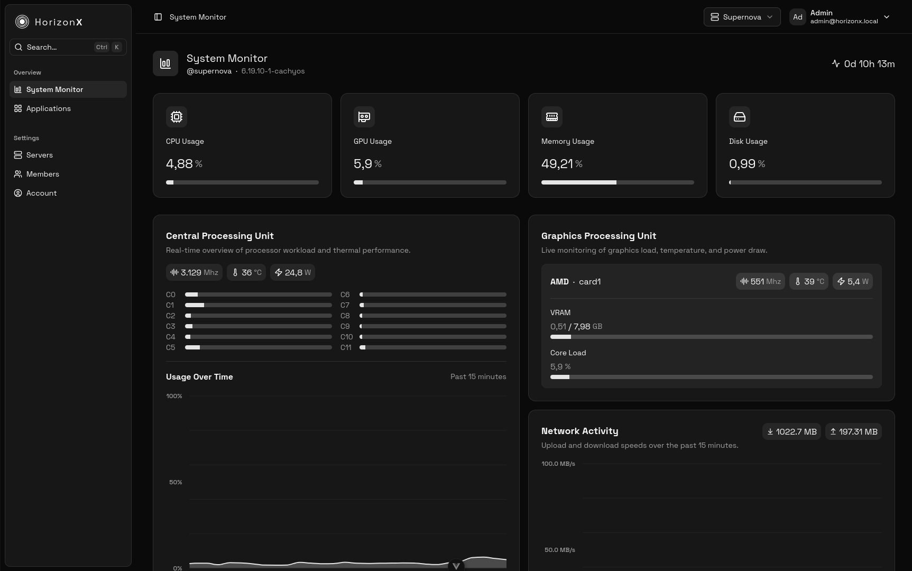
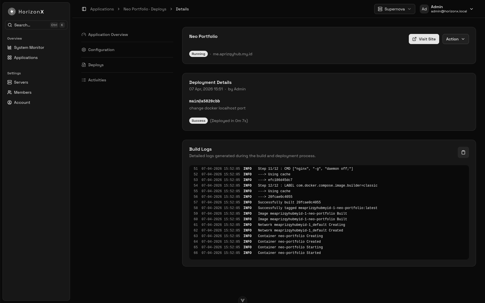

# HorizonX

**Deploy and monitor your apps without babysitting SSH.**

You have a few servers and a handful of apps. Every deploy means `ssh`, `git pull`, `systemctl restart`, and hoping nothing broke while you weren't watching. HorizonX is the control plane that fixes that: connect a lightweight agent to each box, and deploy, roll back, and monitor everything from one dashboard.

> **Note**: This repository contains the **Backend Server** (Go control plane + agent).
> The **Frontend Dashboard** lives here: [https://github.com/zlnew/horizonx-dashboard](https://github.com/zlnew/horizonx-dashboard)

<table>
  <tr>
    <td></td>
    <td></td>
  </tr>
</table>

---

## Why HorizonX?

Because the alternatives are either overkill or a pile of shell scripts.

- **You don't need Kubernetes.** For a handful of apps on a few boxes, K8s is a second full-time job. HorizonX is one binary, one agent per box, one dashboard.
- **You don't need to babysit deploys.** The agent pulls from git, builds the image, and health-gates the rollout — success only counts when the app is actually running. No more "it deployed" followed by a 502.
- **You get real rollback.** Every deploy tags the image; rollback replays the previous tag. One click, no `git revert` ritual.
- **You can see what's happening.** Live CPU/RAM/disk/network per server, plus deploy history and job logs — without another monitoring SaaS.

**The shape of it** — a client-server model:

```
┌─────────────┐   WebSocket    ┌──────────────┐
│  Agent       │ ◄────────────► │  Server      │
│  (per box)   │                │  (control    │
│              │   push metrics │   plane)     │  ◄── Dashboard (Vue 3)
└──────┬───────┘   receive jobs │              │
       │                        └──────────────┘
       │  docker compose
       ▼
   your apps
```

1. **Server (control plane)** — the central API: apps, servers, users, deploy jobs. You talk to it through the dashboard.
2. **Agent (runner)** — a single binary you install on each Linux box. It connects back over a persistent WebSocket, pushes hardware metrics, and executes commands like *Deploy App* using Docker Compose.

---

## Key features

- **Real-time infrastructure monitoring** — CPU, memory, disk, network, GPU, per second, per server.
- **Zero-downtime deployments** — GitOps pull → compose build → health-gated up. In-place recreate, never `compose down`.
- **One-click rollback** — image tags are recorded per deploy; replay any previous tag.
- **Env vars & secrets** — inject per-app environment without touching the repo.
- **Multi-stage builds** — the agent builds through `docker compose build`, so each service gets the right target (php-fpm vs nginx) automatically.
- **Secure by default** — token-authenticated agents, audit log, role-based access.

---

## Quick start

### 1. Install the binary (one-liner)

```bash
curl -fsSL https://raw.githubusercontent.com/zlnew/horizonx/main/install.sh | sudo bash
```

(`sudo` is for the root-owned `/usr/local/bin`; plain `| bash` auto-elevates
via sudo if needed, and `HORIZONX_PREFIX=$HOME/.local` gives a rootless
install.) The installer:

- Fetches the latest release tarball + `SHA256SUMS`, **verifies the checksum**
- Installs `horizonx` to `/usr/local/bin`

### 2. Install the control plane (docker bubble)

```bash
horizonx install server
```

One command, one bubble. It installs (or upgrades) everything at `/opt/horizonx`:

- **Server** — the control plane API, exposed on **port 4858**
- **Dashboard** — the Vue UI, bundled and served on **port 4859**
- **Postgres + Redis** — private to the bubble (no host ports)

The dashboard is fetched automatically: `install server` resolves the latest
[horizonx-dashboard](https://github.com/zlnew/horizonx-dashboard/releases)
release, downloads the image tarball + SHA256SUMS, verifies the checksum, loads
the image, and starts the dashboard. Nothing to download by hand — it's cached
in `/opt/horizonx/dashboard/` and reused on upgrade (re-verified against the
release checksum each time).

If the dashboard can't be fetched (no network, release API unreachable), the
install still succeeds with a warning — the control plane always comes up; add
the dashboard later with `docker compose -f /opt/horizonx/docker-compose.yml up -d dashboard`.

The flow is *preflight → generate → validate → apply → verify*:

1. **Preflight** probes real capabilities — docker socket access, Compose ≥ 2.20,
   free ports. If docker is installed but your user can't reach the socket, it
   tells you exactly what to fix (`sudo usermod -aG docker $USER && re-login`).
2. **Generate** writes the full bubble tree (root compose + `server/` + `dashboard/`).
   Everything builds from the release tarball — **no registry pulls, ever**.
3. **Validate** runs `docker compose config --quiet` before touching anything.
4. **Apply** brings up postgres + redis + server, then fetches + loads + starts
   the dashboard from its latest release (checksum-verified; best-effort).
5. **Verify** polls `GET /health` on 4858 until the control plane answers, then
   prints the URLs + first-login info.

Preview without applying: `horizonx install server --generate-only`.

The ports are signature ports, not common ones: **4858 = 0x4858 = ASCII "HX"**.
Override with `HORIZONX_PORT` / `DASHBOARD_PORT` in `/opt/horizonx/.env`.

Requirements: **Linux**, **Docker + Compose v2.20+** (the bubble uses the
`include:` feature). Bare-metal/no-docker path: run `horizonx server` in the
foreground with your own postgres/redis.

### 3. Connect an agent to an app host

```bash
curl -fsSL https://raw.githubusercontent.com/zlnew/horizonx/main/install.sh | sudo bash
sudo horizonx install agent
```

On the same box as the server, `install agent` reads the credentials from the
bubble's `.env` — no token juggling. On a different host, pass them:

```bash
sudo horizonx install agent --server http://host:4858 --token <token>
```

The agent runs as the `horizonx` system user via **systemd** (never docker): it
creates the user, adds it to the docker group, generates a git SSH key (prints
the public key for GitHub), installs hardware-monitoring **udev rules**
(powercap/hwmon/thermal/block), and starts the service.

### 4. Deploy your first app

In the dashboard: **Applications → New** → point at a git repo + branch, set env vars → **Deploy**. The agent clones, builds, and health-gates the rollout. Deployments, rollbacks, and job logs are all in the UI.

### 5. Upgrading (self-contained)

```bash
horizonx upgrade
```

Downloads + checksum-verifies the new release, swaps the binary, and
**restarts the running service itself** (systemd unit or compose stack) — you
don't touch anything afterwards.

### 6. Migrations

Migrations run **automatically at server boot** — versioned, idempotent
(no-op when up to date), and concurrency-safe (Postgres advisory lock, so two
racing boots never conflict). Disable with `AUTO_MIGRATE=false`. Manual
control stays available: `horizonx migrate -op=up|down|version|force`.

---

## Requirements

- **Linux** for the agent and server.
- **Docker + Compose v2.20+** for the control plane (the `/opt/horizonx` bubble
  bundles postgres + redis — no manual database setup).
- **Docker + Compose** on each app host (the agent deploys with `docker compose`).
- **Git** on each app host (the agent clones repos).

---

## Development

```bash
# Unified binary (server/agent/install/upgrade/migrate in one)
go build -o bin/horizonx ./cmd/horizonx
bin/horizonx server         # run the control plane

# Legacy split binaries (still supported)
make build                  # bin/server, bin/agent, bin/migrate, bin/seed

# Tests
go test ./...
```

The dashboard is developed in [horizonx-dashboard](https://github.com/zlnew/horizonx-dashboard) (`npm install && npm run dev`).

---

*HorizonX was built to dogfood itself — the workspace that runs it is deployed through it.*
